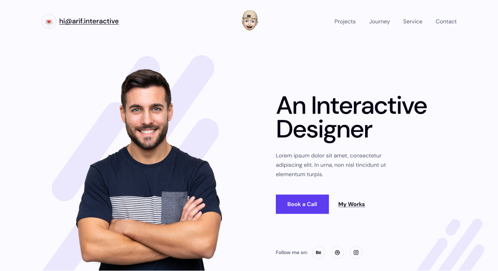

# PROJECT 06 - HTML CSS PRO

- [x] [Figma](https://www.figma.com/design/1odEKQKFzyXexIq2uxwi6K/06.-Arif-Personal-Portfolio-Website--Medium-?node-id=30-70&m=dev)

## Vấn đề gặp phải khi coding
- Thẻ img mặc định là thẻ inline, vì vậy trong giao diện sẽ tự động có khoảng trắng dưới bottom 
    => Giải pháp: chuyển thành thẻ block
